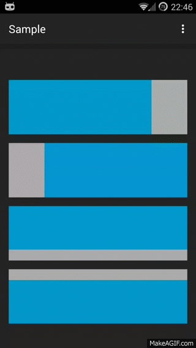
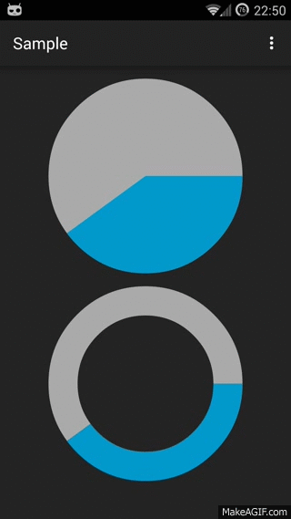
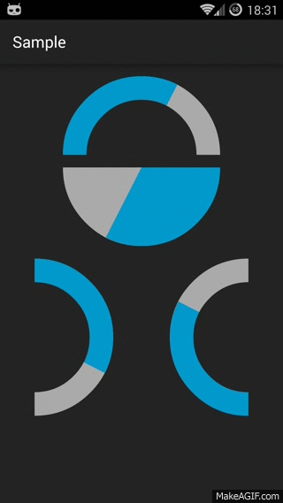
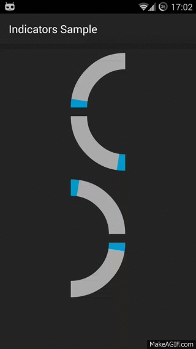

Value Indicators
=============================

Android Library for graphic value representation.

##Modules

* **library** - library code.
* **sample** - simple app to show how to use different indicators via xml or code.
* **showcase** - simple app to show how different parameters affect indicators display.

## Types

- **Circle**
- **Line**
- **Pie**
- **Half Pie**
- **Quarter Pie**
- **Triangle**

..
..

## Usage

Add the following to your build.gradle file:

    repositories {
        mavenCentral()
    }
    dependencies {
        compile 'com.github.bernardpletikosa:value-indicators:1.0.4'
    }

Or user [jar file](https://oss.sonatype.org/content/repositories/releases/com/github/bernardpletikosa/value-indicators/1.0.1/value-indicators-1.0.1-sources.jar)

###Usage overview

Indicator can be set up in code or in xml.
For all indicator types there are some common attributes: minimal and maximal value to indicate, 
animation duration and indicator colors.

    <attr name="main_color" format="color"/>
    <attr name="background_color" format="color"/>
    <attr name="min_value" format="float"/>
    <attr name="max_value" format="float"/>
    <attr name="target_value" format="float"/>
    <attr name="animation_duration" format="integer"/>

For textual value indication on top of indicator use attributes below. Text is shown by default
and can be removed by setting **text_show** to false. All xml attributes have appropriate methods.

    <attr name="text_show" format="boolean"/>
    <attr name="text_animate" format="boolean"/>
    <attr name="text_color" format="color"/>
    <attr name="text_size" format="dimension"/>
    <attr name="text_prefix" format="string"/>
    <attr name="text_suffix" format="string"/>
    <attr name="text_value_decimal" format="boolean"/>

However, there are special values for every indicator type.

#####Circle indicator
    <attr name="circle_radius" format="dimension"/>

#####Line indicator
    <attr name="line_width" format="dimension"/>
    <attr name="line_height" format="dimension"/>
    <attr name="line_direction" format="enum">
        <enum name="left_right" value="2"/>
        <enum name="right_left" value="3"/>
        <enum name="top_bottom" value="4"/>
        <enum name="bottom_top" value="5"/>
    </attr>

#####Pie indicator
    <attr name="pie_radius" format="dimension"/>
    <attr name="pie_center_paint" format="color"/>
    <attr name="pie_inner_radius" format="integer"/>
    <attr name="pie_start_angle" format="integer"/>
    <attr name="pie_direction" format="enum">
        <enum name="clockwise" value="0"/>
        <enum name="counter_clockwise" value="1"/>
    </attr>

#####HalfPie indicator
    <attr name="half_pie_orientation" format="enum">
        <enum name="east" value="0"/>
        <enum name="west" value="1"/>
        <enum name="north" value="2"/>
        <enum name="south" value="3"/>
    </attr>

#####QuarterPie indicator
    <attr name="quarter_pie_orientation" format="enum">
        <enum name="north_east" value="4"/>
        <enum name="south_east" value="5"/>
        <enum name="north_west" value="6"/>
        <enum name="south_west" value="7"/>
    </attr>
        
###Usage Examples

For example, Pie indicator can be set like this

    <com.github.bernardpletikosa.indicators.pie.PieIndicator
        android:layout_width="match_parent"
        android:layout_height="wrap_content"
        indicators:main_color="@color/main"
        indicators:background_color="@color/background"
        indicators:animation_duration="500"
        indicators:min_value="0"
        indicators:max_value="20"
        indicators:pie_center_paint="@color/app_background"
        indicators:pie_radius="100dp"
        indicators:pie_inner_radius="70"
        indicators:pie_start_angle="0"
        indicators:pie_direction="clockwise"/>
or like this

    final PieIndicator pie = (PieIndicator) findViewById(R.id.pie);
    pie.setRange(0, 20); //min and max value, can be negative
    pie.setAnimationDuration(500); //default  value is 500
    pie.setMainColor(getResources().getColor(R.color.main));
    pie.setBackGroundColor(getResources().getColor(R.color.background));
    pie.setAnimationListener(null);
    pie.setInterpolator(new AccelerateDecelerateInterpolator());
    pie.setCenterPaint(getResources().getColor(R.color.center));
    pie.setDirection(Direction.CLOCKWISE); //indication direction CLOCKWISE | COUNTER_CLOCKWISE
    pie.setRadius(SizeUnit.DP, 100);
    pie.setInnerRadius(70); //percentage of total radius
    pie.setStartingAngle(0); //indication start

For every indicator type there are special values that can change indicator looks.

####Circle indicator
Circle indicator is pretty straightforward.

####Line indicator
For line indicator *line_direction* attribute is very important. 
Image below shows all directions *left_right, right_left, top_bottom, bottom_top*, respectively.
    

####Pie indicator
Pie indicators can be full or empty. 
Radius of empty space *pie_inner_radius* is given as a percentage of total radius *pie_radius*.
Color of empty space can be set via *pie_center_paint* attribute.
All pie indicators have *pie_direction* attribute that shows direction of animation which can be 
CLOCKWISE or COUNTER_CLOCKWISE.
Pie indicator specific attribute *pie_start_angle* is used to shift indication start to any angle.

####HalfPie indicator

The only difference in attributes between Pie and HalfPie is *half_pie_orientation*. 
Depending on orientation *north, south, east, west* this indicator will have different 
appearances as shown below.
 Just for example second indicator's *pie_inner_radius* attribute is set to 0.

####QuarterPie indicator

QuarterPie also has a special *quarter_pie_orientation* attribute that can be *north_west,
south_west, north_east, south_east* like on image below. HalfPie also can be full or empty.

####Triangle indicator

Triangle orientation can be *left_right, right_left* like on image below. 

##Special thanks
[Daniel Nadeau](https://bitbucket.org/danielnadeau/holographlibrary/overview) for inspiration

[Chris Banes] (https://github.com/chrisbanes/gradle-mvn-push) for gradle-mvn-push

[Hugo Doménech Juárez] (https://github.com/hudomju) for word of advice